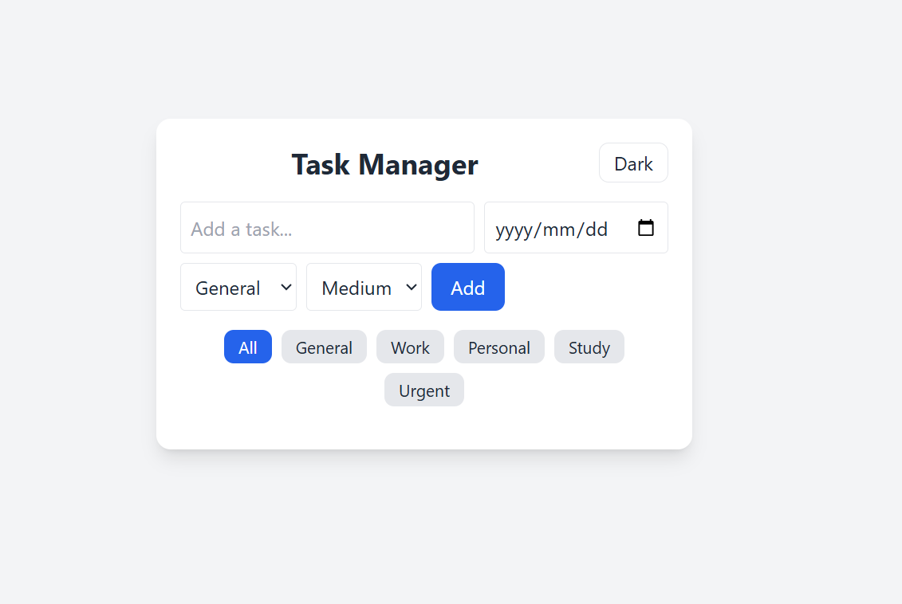
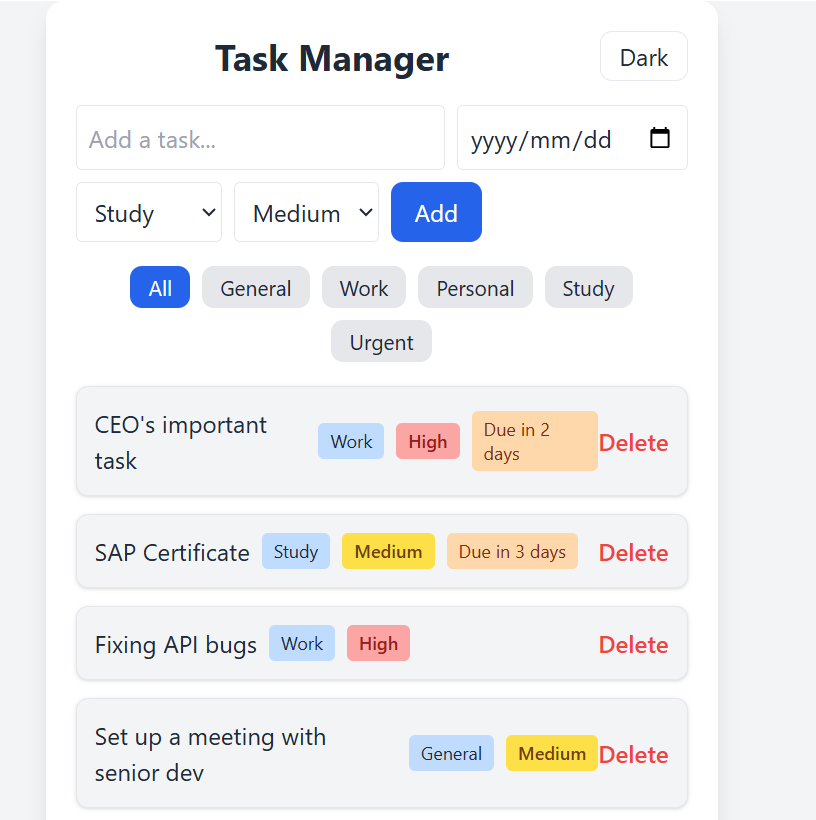
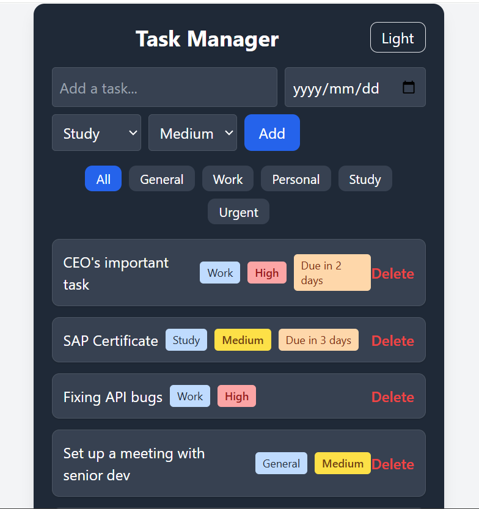
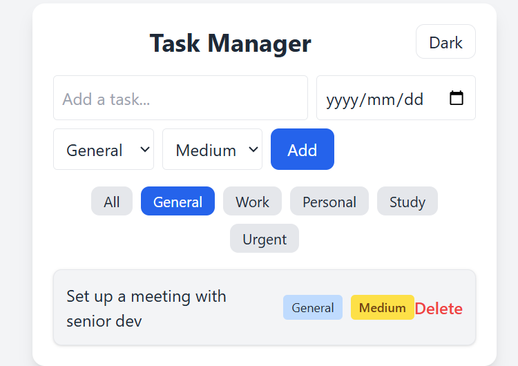

# Task Manager 📝

A modern, interactive **Task Manager** web application built with **React**, **Tailwind CSS**, and **@hello-pangea/dnd**.  
Features **categories, priorities, dark mode, drag-and-drop**, and a **completed tasks section** 
Fully deployed on GitHub Pages: [Live Demo](https://LewoGit.github.io/task-manager/)
---

## 🌟 Features

- **Add tasks** with category and priority
- **Drag & drop** to reorder tasks
- **Auto-sort** by priority (High, Medium, Low)
- **Filter tasks** by category
- **Dark Mode toggle**
- **Mark tasks as completed** (optional)
- **Delete tasks**
- **Responsive design** with modern Tailwind CSS styling
- **LocalStorage** support (tasks persist on reload)

---

## 📸 Screenshots

### Main Task List

### Added Tasks

### Darkmode

### Filter-task-by-category

### Deployment

This section has moved here: [https://facebook.github.io/create-react-app/docs/deployment](https://facebook.github.io/create-react-app/docs/deployment)

### `npm run build` fails to minify

This section has moved here: [https://facebook.github.io/create-react-app/docs/troubleshooting#npm-run-build-fails-to-minify](https://facebook.github.io/create-react-app/docs/troubleshooting#npm-run-build-fails-to-minify)
